 # Laboratorio Clases Abstractas

 ## Parte 1

 ### UML

 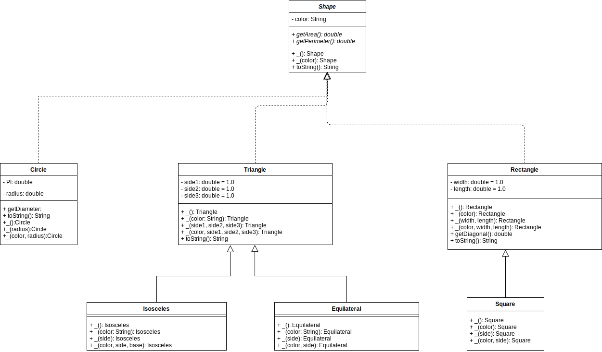

 ### Evidencia pruebas

 ### Circle

 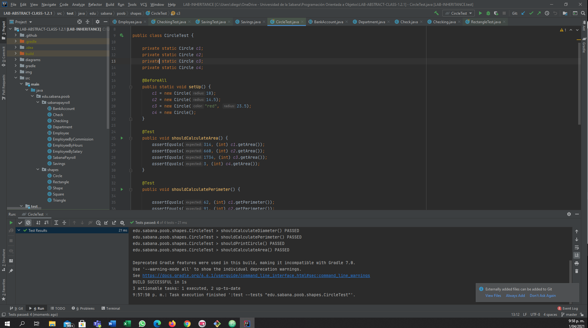

 ### Triangle

 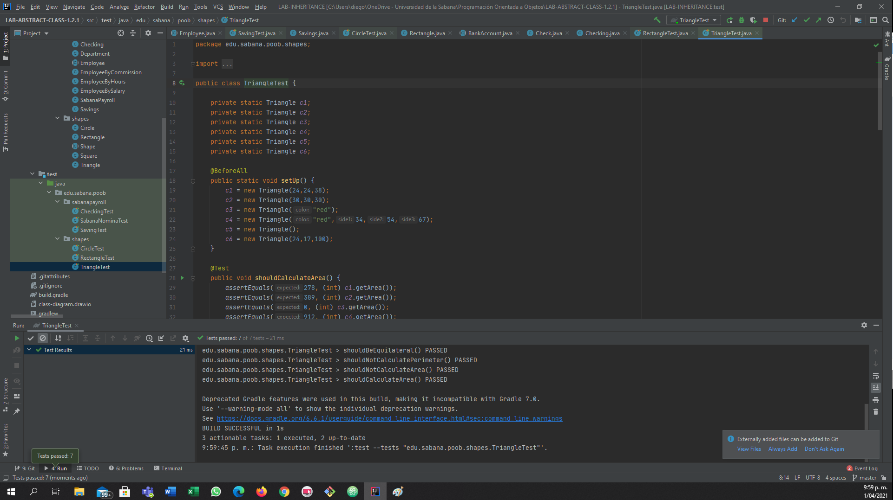

 ### Rectangle && Square

 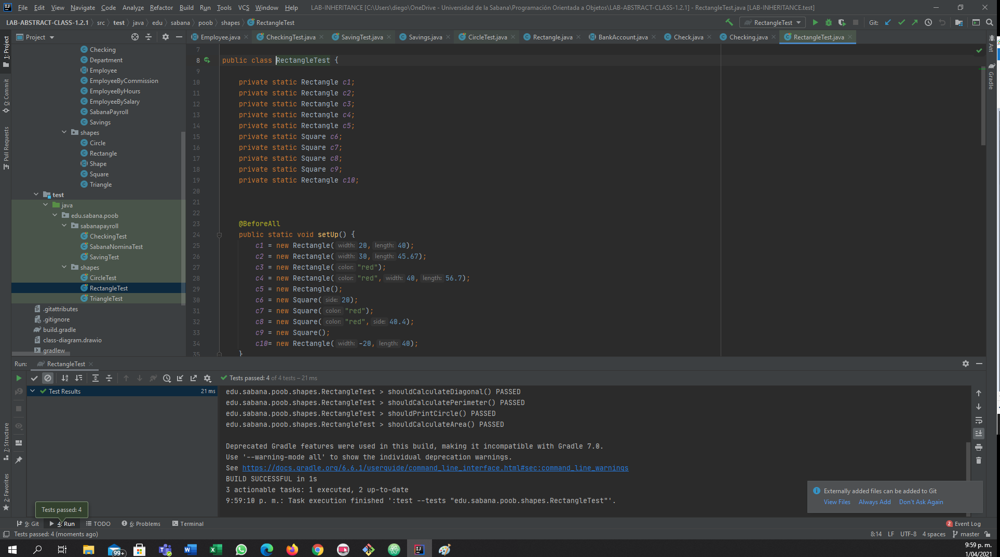

 ## Parte 2

 ### UML

 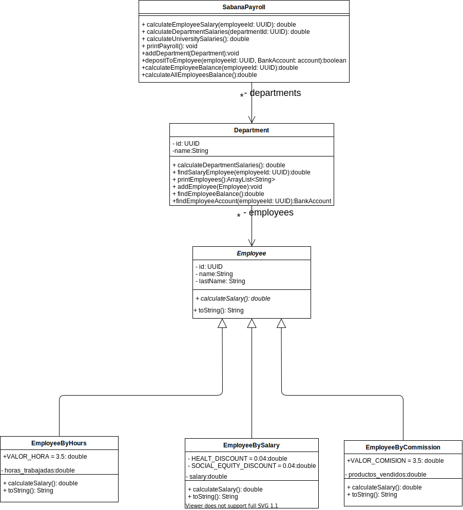

 ### Evidencia pruebas

 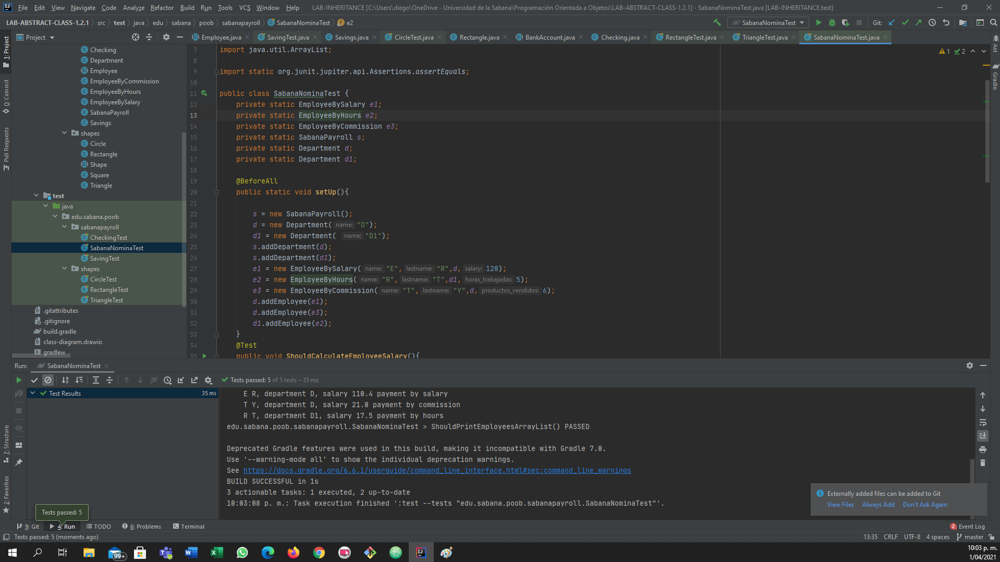

 ## Parte 4

 ### UML

 

 ### Diagramas de secuencia

 ### calculateEmployeeBalance

 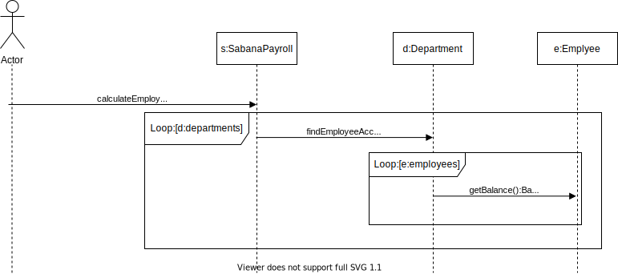

 ### calculateAllEmployeesBalance

 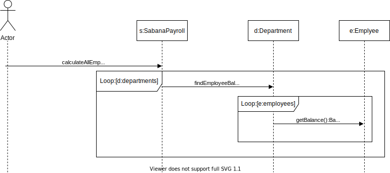

 ### depositToEmployee

 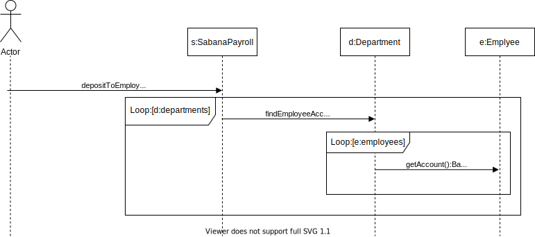

 ### Evidencia pruebas

 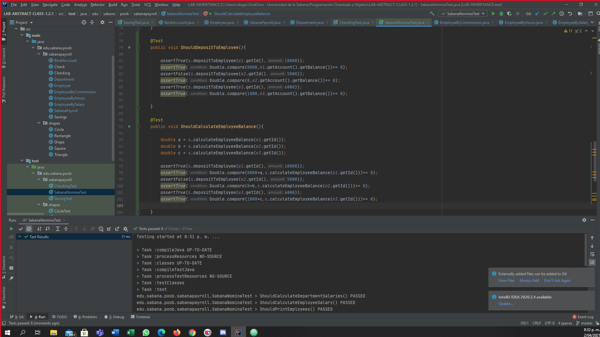

 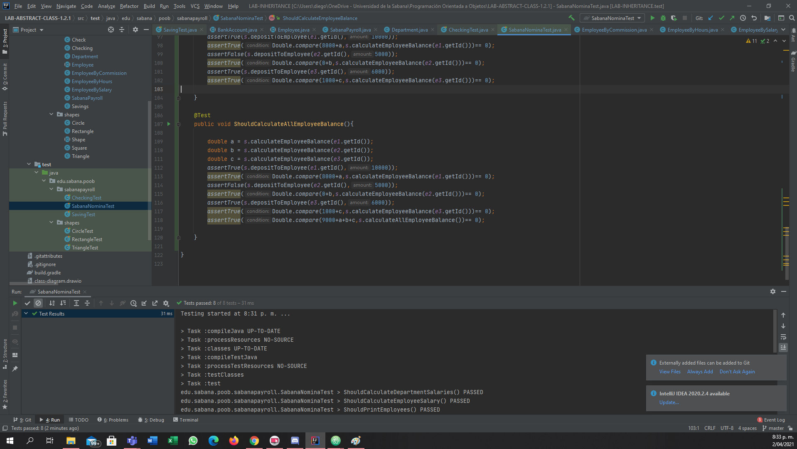

 ## Parte 5

 
