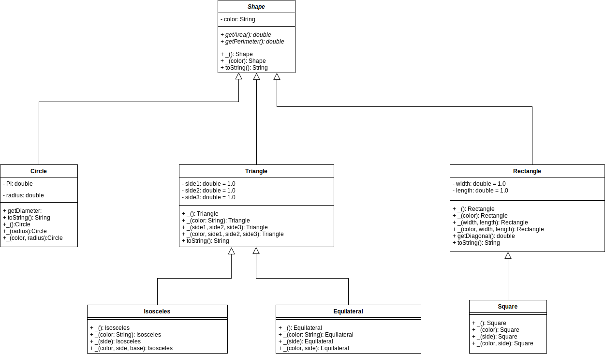

 # Laboratorio Clases Abstractas

 ## Parte 1

 ### UML

 

 ### Evidencia pruebas

 ### Circle

 

 ### Triangle

 

 ### Rectangle && Square

 

 ## Parte 2

 ### UML

 

 ### Evidencia pruebas

 

 ## Parte 3

 ### UML

 
